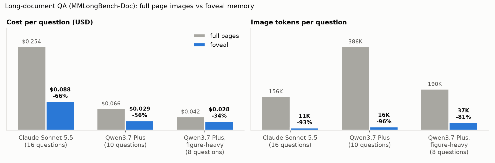

# foveal

**Working memory for multimodal agents: perceive each image once, keep cheap references in
context, zoom into detail only when needed.**

Agent harnesses pay for the same pixels again and again. Every earlier image is re-sent on
every model call, sub-agents re-read pages another agent already read, and old screenshots
stay in context with nothing marking them outdated. foveal is a model-agnostic layer that
stores each visual input once and sends a model only what it needs: a caption and the text
first, pixels on request, and for screens, only what changed.

## Results

### Long-document QA

MMLongBench-Doc: 4 documents of 28–60 pages, an orchestrator with reader sub-agents. Each
model answers the same questions in both modes, and one judge scores every answer.

| Model | Mode | Correct | Image tokens / question |
| --- | --- | --- | --- | --- |
| Claude Sonnet 5.5 (16 questions) | full page images | 10/16 | 156K |
| | **foveal memory** | **10/16** | **11K (-93%)** |
| Qwen3.7 Plus via OpenRouter (10 questions) | full page images | 10/10 | 386K |
| | **foveal memory** | **8/10** | **16K (-96%)** |
| Qwen3.7 Plus, figure/table/chart questions (8 new) | full page images | 7/8 | 190K |
| | **foveal memory** | **7/8** | **37K (-81%)** |

<picture>
  <source media="(prefers-color-scheme: dark)" srcset="docs/figures/docqa-dark.png">
  
</picture>

Cost per question includes foveal's one-off captioning: about $0.0006 per page with Claude
Haiku 4.5, or $0.00015 with Qwen.

### Screenshot history (offline replay, no model calls)

Estimated cost of sending screenshot history to Claude Sonnet 5.5 under each policy. Prompt
caching is applied wherever the policy keeps a stable prefix.

| Workload | All screenshots | Last 3 only | **foveal diffs, all history kept** |
| --- | --- | --- | --- |
| Web agent: 113 Mind2Web trajectories, 725 steps | $2.81 | $4.39 | **$2.16** |
| Screen recordings, one frame every 2 s (507 frames) | $4.23 | $2.80 | **$2.42** |
| Screen recordings, one frame every 5 s (205 frames) | $0.96 | $1.10 | **$0.74** |

Every reconstructed frame was pixel-exact on Mind2Web, including the element each action
targeted (579 of 579). On compressed video, at most 0.27% of pixels were off.

### What we learned

- **Most image tokens are repeats.** Without foveal, 62% of image tokens in the doc-QA
  harness were pixels already sent earlier in the same question (86% on Qwen). Of the pages
  "seen for the first time", 65% had already been read for an earlier question on the same
  document.
- **Perceive once, pay a fraction.** Captions and text layers answer many questions, and
  `look()` fetches pixels when they're needed. Image tokens fell 93–96% on both models.
- **The accuracy cost depends on the model.** Claude Sonnet 5.5 kept full accuracy. Qwen3.7
  Plus lost 2 of 10 on the first set. On a URL count and a figure question it trusted the
  text instead of calling `look()`, so weaker tool users may need foveal to promote images
  more readily. On fresh figure-heavy questions Qwen matched full pages (7/8 each), and the
  saving was smaller (-34% cost) because it rightly looked at more pixels.
- **Shared notes didn't pay off on this workload.** Agents wrote 60 notes, but later
  questions on the same document asked about different things, so the notes rarely
  answered them. Writing and reading notes added calls: memory + notes cost 17% more and
  scored 8/13 against 9/13. Reuse across questions does happen at the page level, where
  each document's captions and text are stored once. Facts need workloads where agents
  share what they need, such as screens or parallel readers.
- **Keeping only the last N screenshots defeats prompt caching.** The sliding window changes
  the prompt prefix every step, so on web tasks it costs *more* than sending everything.
  foveal's append-only diffs keep all the information for about half the cost of keep-last-3.
- **Once pixels are cheap, agent overhead dominates.** In foveal mode most of the remaining
  cost is text (captions, page text and conversation history re-sent on every call), not
  images.

Full write-up: [docs/technical_report.md](docs/technical_report.md). Per-question details are
in [docs/results/](docs/results/).

## Features

- **Perceive-once asset store.** Images, PDF pages and screenshots are stored once by
  content hash, in SQLite plus files on disk.
- **Representation levels.** **L0** a one-line caption, **L1** the text layer or OCR, **L2**
  a thumbnail of at most about 256 tokens, **L3** full detail. PDF regions are re-rendered
  at higher resolution, so zooming in gains real detail.
- **`look(asset, region, detail)`** pages pixels in on demand.
- **Diff sync for screens.** Change detection that tolerates JPEG noise, scroll detection
  that works under sticky headers, versioned streams (`ingest_frame`), and
  `diff_since(source, version)`.
- **Shared facts with provenance.** `write_fact`, `recall_facts` and `verify_fact`, with
  region-aware invalidation: a fact goes stale only when its region changes, and moves
  with scrolling.
- **Subscriptions.** Agents are notified when a screen area changes, through SQLite (shared
  across processes) or Redis (shared across machines).
- **Budget- and cache-aware context assembly.** The assembler demotes old images only when
  the cache rewrite pays for itself.
- **Drop-in middleware.** `foveal.wrap(client, memory)` works with Anthropic- and
  OpenAI-format clients. Its rewrites are prefix-stable, so prompt caching keeps working.
- **MCP server.** `foveal-mcp` gives any MCP client (Claude Code, IDEs, custom agents) the
  memory as tools.
- **Instrumentation.** A pass-through client logs every image's hash, size and token cost,
  plus call usage, and reports re-perception.

## Install

```sh
git clone https://github.com/shubh-tiwari/foveal && cd foveal
uv sync --all-extras          # or: pip install -e ".[anthropic,pdf,mcp,redis,ocr,video]"
```

Python 3.10+.

## Quick start

**Memory: store once, read cheaply, zoom on demand**

```python
import anthropic
from foveal import Captioner, Memory

mem = Memory(".foveal", captioner=Captioner(anthropic.Anthropic()))  # captions via Claude Haiku 4.5
pages = mem.ingest("report.pdf")  # each page perceived once
print(mem.describe(pages[3].asset_id))  # caption + text layer, no image tokens
chart = mem.look(pages[3].asset_id, region=(0.1, 0.45, 0.9, 0.8), detail="full")
chart.block()  # an Anthropic image block
```

**Screens: versions and diffs**

```python
mem.ingest_frame(screenshot_png, source="tab:checkout")  # version 1
mem.ingest_frame(next_png, source="tab:checkout")  # version 2, with its diff
mem.diff_since("tab:checkout", 1).blocks()  # "scrolled down 250px, except ..." + crops
```

**Shared facts and change notifications**

```python
f = mem.write_fact(
    shot.asset_id,
    "order total is $120",
    region=(100, 400, 300, 40),
    author="reader-1",
    source="tab:checkout",
)
mem.recall_facts("what is the order total?")  # fresh facts, with provenance
mem.subscribe("orch", "tab:checkout", region=(100, 400, 300, 40))
mem.poll("orch")  # change / stale-fact events
```

**Middleware: no code changes in your agent loop**

```python
import foveal

client = foveal.wrap(anthropic.Anthropic(), mem)  # or foveal.wrap(openai_client, mem, fmt="openai")
client.messages.create(model="claude-sonnet-5-5", max_tokens=4096, messages=history)
client.last_stats.saved  # image tokens not re-sent on this call
```

**MCP server**

```sh
claude mcp add foveal -- uv run --directory /path/to/foveal foveal-mcp --store ~/.foveal
```

Its tools are `ingest`, `ingest_frame`, `describe`, `look`, `diff_since`, `recall_facts`,
`write_fact`, `verify_fact`, `subscribe` and `poll`. Use `--redis-url` to share facts
across machines.

## Reproduce

API keys are read from `.env`: `ANTHROPIC_API_KEY`, and `OPENROUTER_API_KEY` for other models.

```sh
# Doc QA: full pages vs foveal memory (add --provider openrouter --orch-model ... for other models)
uv run python -m bench.mmlongbench.run --docs 4 --per-doc 4 --run-id base
uv run python -m bench.mmlongbench.run --docs 4 --per-doc 4 --run-id fov --mode memory
uv run foveal compare runs/base.jsonl runs/fov.jsonl --judge

# Screen replays ($0, no model calls)
uv run python -m bench.replay.simulate --shards 2
uv run python -m bench.replay.simulate --source video --every-s 2

# Free dry runs of every evaluation, then the figures
uv run python -m bench.suite --dry-run
uv run python -m bench.figures --judge
```

Every live run takes `--max-cost-usd` and stops when its logged cost reaches it. The suite
refuses to start runs whose caps add up to more than `--budget`.

## Limitations and next steps

- The samples are small: 16 and 10 doc-QA questions, where one question moves accuracy by
  6–10 points.
- The screen results come from offline replay. A live web-agent accuracy run (Mind2Web
  next-action prediction under each history policy) is built but not yet run.
- Next:
  - Auto-promote images for models that under-use `look()`.
  - Test shared facts on a workload where agents need the same facts (parallel readers,
    screens).
  - Run the live Mind2Web check.

The development history is in [docs/development_log.md](docs/development_log.md).

## License

MIT
