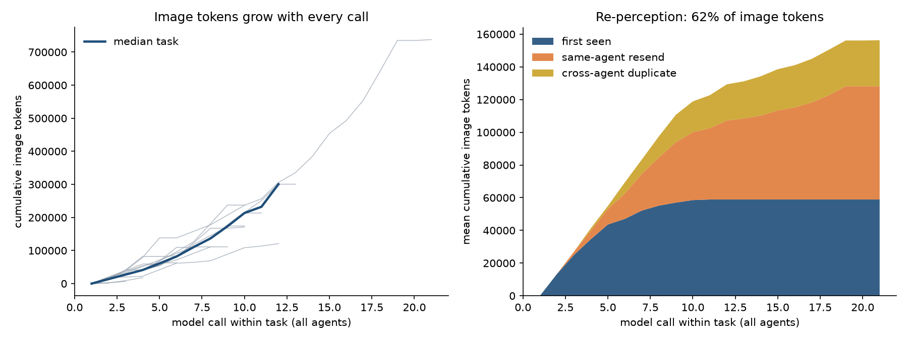

# foveal

Multimodal working memory for agents: perceive each image once, keep cheap references in
context, zoom into detail only when needed, and share what was learned across sub-agents.

> Status: **Phase 0 (measurement).** The memory layer isn't built yet. This repo currently
> measures how many image tokens agent harnesses spend re-sending pixels they already sent.

## Phase 0 result

On 16 MMLongBench-Doc questions answered by Claude Sonnet 5.5 (an orchestrator plus reader
sub-agents), **62.3% of all image tokens were pages already sent earlier in the same task**.
That passes the 40% gate. Prompt caching already served about 74% of those repeats. See
[ROADMAP.md](ROADMAP.md) for the full numbers.



## Memory (Phase 1)

```python
import anthropic
from foveal import Captioner, Memory

mem = Memory(".foveal", captioner=Captioner(anthropic.Anthropic()))  # L0 via Claude Haiku 4.5
pages = mem.ingest("report.pdf")  # each page perceived once, deduplicated by content hash
print(mem.describe(pages[3].asset_id))  # L0 caption + L1 text layer: no image tokens
glimpse = mem.look(pages[3].asset_id)  # L2: about 256 tokens
chart = mem.look(pages[3].asset_id, region=(0.1, 0.45, 0.9, 0.8), detail="full")
chart.block()  # an Anthropic image block
```

| Level | Contents | Cost |
| --- | --- | --- |
| L0 | One-line caption, cached by hash | A few dozen text tokens |
| L1 | PDF text layer, or OCR with the `ocr` extra | Text only |
| L2 | Thumbnail | At most about 256 image tokens |
| L3 | Full page, or a region re-rendered from the PDF at higher resolution | Full image cost |

**Phase 1 result:** on the same 16 questions, memory mode matched the full-image baseline. Both
scored 10/16, with every task getting the same verdict. Image tokens fell 84% (95% at task
time), and cost fell from $4.06 to $1.53 including captions.

The benchmark compares this against sending full pages:

```sh
uv run python -m bench.mmlongbench.run --mode memory --docs 4 --per-doc 4
uv run foveal compare runs/<baseline>.jsonl runs/<memory>.jsonl
```

## Diff sync (Phase 2, offline replay)

`foveal.diff.diff_frames(prev, curr)` returns identical, partial (changed boxes, plus any
scroll) or full. On 113 recorded web-agent trajectories, sending only the diffs while keeping
history append-only cost **51% less than keep-last-3** and 23% less than full history. It
kept every frame's information, and every reconstruction was pixel-exact. Token savings are
smaller (-21%), because web tasks change pages often. See
[docs/phase2_replay_mind2web.md](docs/phase2_replay_mind2web.md).

## Phase 0: measure re-perception

`foveal.instrument` wraps the Anthropic client without changing any request. It logs every
image block in every call (sha256, pHash, size, token cost, position) together with `usage`,
and writes one JSONL line per call:

```python
import anthropic
from foveal.instrument import InstrumentedAnthropic, JsonlSink, TokenCounter, Tracer

raw = anthropic.Anthropic()
tracer = Tracer("run1", JsonlSink("runs/run1.jsonl"), TokenCounter(raw))
client = InstrumentedAnthropic(raw, tracer)
with tracer.scope(task_id="q1", agent_id="orch"):
    client.messages.create(...)
```

The test harness is a long-document QA orchestrator with reader sub-agents, run on
[MMLongBench-Doc](https://huggingface.co/datasets/yubo2333/MMLongBench-Doc):

```sh
uv sync --all-extras
uv run python -m bench.mmlongbench.run --dry-run                   # offline, free
uv run python -m bench.mmlongbench.run --docs 1 --per-doc 1        # one live task
uv run python -m bench.mmlongbench.run --docs 4 --per-doc 4 --max-cost-usd 6
uv run foveal analyze runs/<run_id>.jsonl                          # report.md + plot
```

The default model is Claude Sonnet 5.5 (`claude-sonnet-5-5`) for both the orchestrator and the
readers. Use `--orch-model` and `--reader-model` to change them. For example,
`--reader-model claude-haiku-4-5` sends reader pages at standard resolution for less.

The report covers:

- **Re-perception rate:** the share of image tokens whose exact image was already sent in
  the same task. It is split into same-agent resends and cross-agent duplicates.
- **Near-duplicate and cross-task shares:** how much of the first-seen traffic a memory
  layer could still reuse.
- **Image tokens under keep-last-3:** the common workaround, simulated from the same logs.
- **Cache-adjusted cost:** how much of the repeated traffic prompt caching already discounts.
- **Gate:** PASS when re-perception is at least 40%.

Image token estimates follow the Vision docs: `⌈w/28⌉·⌈h/28⌉` after downscaling to the
model's tier limits. Ground truth comes from `messages.count_tokens`, cached per image hash.

## Roadmap

Phase 0 (measure) is in progress. Phases 1–4 build the asset store and L0–L3 ladder, diff
sync, shared facts, and the budget-aware assembler with MCP and SDK interfaces. See
[ROADMAP.md](ROADMAP.md) for each phase's scope and gate.
