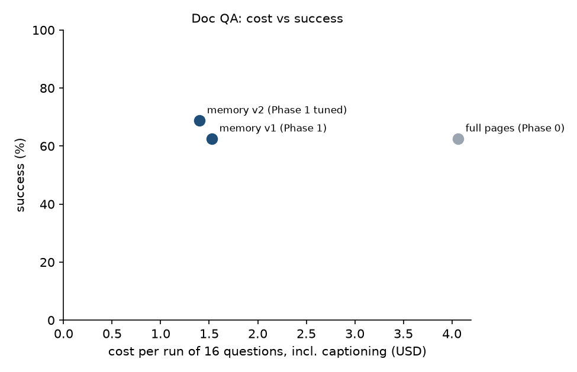

# foveal: perceive-once working memory for multimodal agents

*Technical report draft, 2 October 2026. Every number here comes from the logs and replays
in this repository. Runs still waiting for budget are listed at the end.*

## Summary

Agent harnesses pay for the same pixels many times. They re-send image history on every
call, sub-agents re-read what others already saw, and nothing marks old observations as
outdated. foveal is a model-agnostic memory layer. It stores each visual input once, keeps
cheap representations in context, pages in detail on demand, sends screen changes as diffs,
and shares facts across agents with region-level invalidation.

On long-document QA with Claude Sonnet 5.5, an orchestrator and reader sub-agents re-sent
images heavily: **62% of image tokens were repeats**. Replacing raw pages with foveal's
levels (caption and text by default, pixels only through `look()`) kept success the same
under one judge (11/16 vs 10/16) and cut **image tokens by 93% and cost by 66%**. On recorded
screen streams, diff sync with append-only history cut cost **23–43% against full history**.
On web tasks it was about **half the cost of keep-last-3**, because sliding windows defeat
prompt caching.

## 1. Measuring the problem

We wrapped the Anthropic client without changing any request and logged every image block:
its sha256, pHash, size, and token cost. Token costs were estimated with the Vision docs'
⌈w/28⌉·⌈h/28⌉ formula after the tier's resize, which agreed with `count_tokens` to within
0.2%. Each call's `usage` was logged too.

**Workload.** MMLongBench-Doc, 4 documents of 28–60 pages, 16 questions. A Sonnet 5.5
orchestrator sends reader sub-agents to page ranges, in parallel where useful, and can view
pages itself. Pages are 1568 px on the long edge.

| Metric | Value |
| --- | --- |
| Image tokens | 2.50M over 136 calls |
| Re-perception rate (exact repeats within a task) | **62.3%** (44.3% same agent, 18.0% another agent) |
| Median task / excluding the largest task | 50.5% / 52.9% |
| First-seen pages already read for an earlier question on the same document | 65% |
| Saving from keeping only the last 3 image messages | 6% |
| Repeated tokens already served from prompt cache | ~74% |

Two things stand out. Prompt caching already discounts most resends, so the dollar
opportunity is smaller than the token opportunity. And keep-last-N barely helps, because
resends sit inside multi-page tool results. Both points shaped the design.

## 2. Design

| Component | What it does |
| --- | --- |
| Asset store | Content-addressed (SQLite plus blobs on disk): an input is perceived once per hash |
| Levels | **L0** one-line caption (Haiku 4.5, from a 384-token downscale). **L1** PDF text layer, or OCR for scanned pages. **L2** thumbnail of at most 256 tokens. **L3** full image, or a region re-rendered from the PDF at higher resolution |
| `look(asset, region, detail)` | Pages pixels back in on demand |
| Diff engine | Tile-based change detection that tolerates JPEG noise, vertical scroll detection (also under sticky headers and footers, robust to toasts), merged change boxes, pixel-exact reconstruction |
| Versioned streams | `ingest_frame(source)`: an unchanged frame creates no version; `diff_since(source, v)` returns text plus exact crops |
| Shared facts | Claims with asset, version, pixel region, level seen, confidence and author; BM25 recall; `verify_fact` zooms into the cited region |
| Region-aware invalidation | A fact survives a change elsewhere and moves with a scroll; it goes stale if its region changes, scrolls away, or it has no region. Its author is notified |
| Subscriptions and backends | Screen-area subscriptions with polled events; SQLite in WAL mode (cross-process) or Redis (streams plus pub/sub) |
| Assembler | Levels chosen at insertion under a budget; batch demotion only when a cache model shows the rewrite pays for itself |
| SDK middleware | Rewrites Anthropic- or OpenAI-format history: repeats become references, same-stream screenshots become diffs. Every decision depends only on earlier messages, so the rewritten history is byte-stable across calls (good for caching and preserved thinking) |
| MCP server | `foveal-mcp`: ingest, ingest_frame, describe, look, diff_since, recall/write/verify facts, subscribe, poll |

**Design rule: stay append-only.** Rewriting earlier turns breaks the prompt-cache prefix.
On models that bind thinking blocks to the exact history, such as Claude Opus 5.5 and Sonnet
5.5, it also invalidates earlier reasoning. So foveal decides each block's form when the
block enters the context and never revisits it, except in a deliberate batch compaction
that the assembler's cost model has to justify.

## 3. Results

### 3.1 Document QA (same 16 questions)

Success is judged by Claude Haiku 4.5, applied identically to every run. The rule-based
scorer missed correct paraphrases such as "the document mentions no cooler" for a "Not
answerable" gold answer.

| Configuration | Success | Image tokens | Cost incl. captions |
| --- | --- | --- | --- |
| Full page images (baseline) | 10/16 | 2.50M | $4.06 |
| foveal memory, captions from full pages | 10/16 | 389K | $1.53 |
| foveal memory, 384-token caption images | 11/16 | 183K (61K are one-off captions) | **$1.40** |

**Where the money goes now.** Captioning costs about $0.002 per page, once. Images are
$0.17. The largest line is text, $0.80: captions, text layers and conversation history
re-sent on every agent call. Showing only a text preview, with full text on request, did
not help. Agents fetched the full text anyway, which added 15 calls. That's a lesson for
harness design: once pixels are cheap, per-call overhead dominates.

### 3.2 Screen streams (offline replay, no model calls)

| Workload | Policy with full information | Image tokens vs full history | Est. cost (Sonnet 5.5, caching where the prefix allows) |
| --- | --- | --- | --- |
| Mind2Web, 113 web trajectories, 725 steps | foveal_diff | -21% | $2.16 vs $2.81 (full) vs **$4.39 (keep-last-3)** |
| Screen recordings, one frame every 2 s (507 frames) | foveal_diff | -43% | $2.42 vs $4.23 (full) vs $2.80 (keep-last-3) |
| Screen recordings, one frame every 5 s (205 frames) | foveal_diff | -23% | $0.74 vs $0.96 (full) vs $1.10 (keep-last-3) |

Reconstruction was pixel-exact on Mind2Web, including every action target (579 of 579), and
at most 0.27% of pixels were off on compressed video. Web tasks load new pages in 63% of
steps, so diffs save less there than on continuous video.

**The finding we did not expect: sliding windows defeat prompt caching.** Keep-last-N
changes the prompt prefix every step, so nothing is read from cache. On web tasks it costs
more than sending the full history. Append-only diff history keeps all the information for
about half the cost of keep-last-3. Prompt-cache structure should be a primary design
input for context management, not an afterthought.

## 4. Limitations

- Samples are small: 16 doc-QA questions, so a single question is 6 points of success.
- The doc-QA PDFs mostly have text layers. Scanned and figure-heavy documents use OCR and
  `look()` more heavily, and that slice is a pending run.
- The screen results are offline. A live web-agent accuracy check under each policy is
  built but not yet run. The stale-action rate needs a live screen loop.
- One model family (Claude). The middleware handles OpenAI-format messages, but no
  cross-provider run exists yet.

## 5. Pending runs (built, waiting for budget)

| Run | Purpose | Cap |
| --- | --- | --- |
| `p1-scale` | 24 fresh figure, table and chart questions, full pages vs memory | $14 |
| `p2-live` | Mind2Web next-action accuracy: full history vs keep-last-3 vs foveal diffs | $5 |
| `p3-facts` | Same 16 questions with shared notes across questions | $3 |

`uv run python -m bench.suite --run <name> --budget <usd>` runs them. The suite refuses any
set of runs whose caps exceed the budget.
